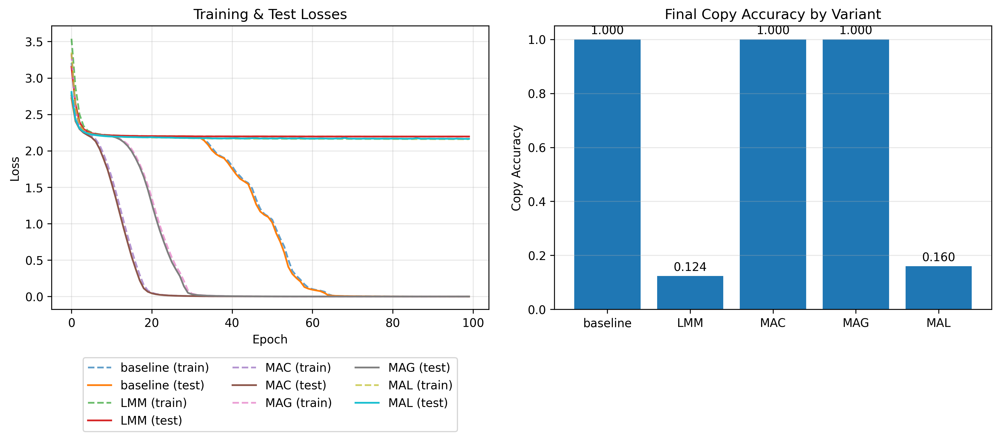
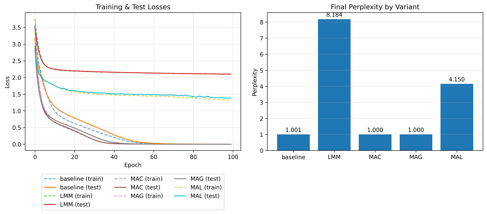
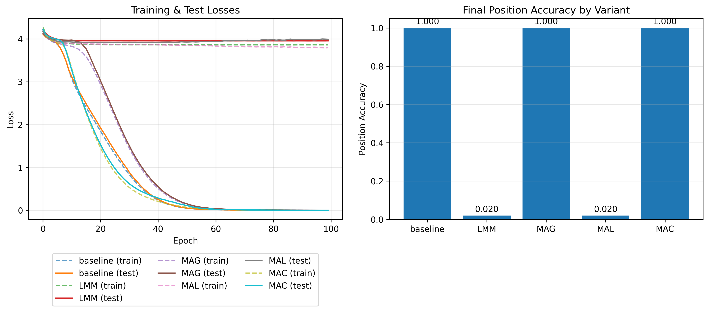

## Titans Neural Memory Implementation: Technical Report

## Table of Contents

1. [Overview](#overview)
2. [Core Neural Memory Mechanism](#introduction)
   - [Mathematical Formulation](#mathematical-formulation)
   - [Component Analysis](#component-analysis)
3. [Architectural Variants](#architectural-variants)
4. [Experimental Design](#experimental-design)
5. [Scope and Limitations](#scope-and-limitations)
6. [Implementation Details](#implementation-details)

## Introduction

This implementation explores the core neural memory mechanism from "Titans: Learning 
to Memorize at Test Time" (Behrouz et al., 2024). The architecture addresses sequence modeling challenges through adaptive memory systems that update parameters during inference, allowing the system to adapt to new data during inference.

### Mathematical Formulation

The neural memory system operates through a two-stage update mechanism that combines momentum-based learning with adaptive forgetting:

$$ S_t = η_t * S_{t-1} - θ_t * ∇ℓ(M_{t-1}; x_t) $$
$$ M_t = (1 - α_t) * M_{t-1} + S_t $$

This formulation represents a meta-learning strategy where the memorisation approach 
is learned during training and applied during inference. The system learns how to adapt its own parameters in response to surprising inputs, rather than learning task-specific solutions.

**Surprise Momentum ($S_t$)** maintains a temporal memory of surprise across the 
sequence, combining the historical surprise trajectory with the current surprise measurement. This accumulation enables the system to preserve adaptation context even when current gradients become small due to network saturation or flat loss regions.

**Memory State ($M_t$)** represents the memory state that encodes associative key-value 
mappings through the neural network's parameters.

### Component Analysis

**Data-Dependent Parameters**

The following parameters are computed from the current input rather than being 
fixed constants, allowing the system to adapt its learning behavior based on the characteristics of incoming data:

- $η_t$: Historical surprise decay rate, controlling momentum persistence
- $θ_t$: Momentary surprise weighting, scaling current gradient contribution  
- $α_t$: Forgetting gate activation, enabling selective memory reset

**Surprise Metric Definition**

The system quantifies input surprise through the gradient of associative memory loss: 

$$∇ℓ(M_{t-1}; x_t)$$ 

where the loss function computes the squared L2 norm between the memory network's 
prediction $M_{t-1}(k_t)$ and the target value $v_t$.

$$ℓ(M_{t-1}; x_t) = ||M_{t-1}(k_t) - v_t||²$$ 

This is the instantaneous measure of surprise indicating how much the current input deviates from what the memory network expects. Larger gradient magnitudes indicate greater deviation between predicted and actual key-value associations, signaling unexpected input patterns that warrant stronger memorization. This gradient-based approach provides a principled measure of input novelty relative to current memory state.

**Momentum Mechanism for Optimization Stability**

Test-time adaptation faces a critical optimization challenge: large gradient steps from out-of-distribution inputs can push networks into degenerate states where subsequent gradients vanish despite poor performance. The momentum formulation addresses this by:

- **Maintaining update direction** when current gradients become small due to network saturation or flat loss regions
- **Preserving adaptation context** so the system continues updating even when individual gradient steps provide weak signals
- **Enabling escape** from parameter configurations where the network produces low loss values despite poor actual performance

**Adaptive Forgetting for Memory Management**

The forgetting mechanism addresses memory capacity limitations through principled parameter decay. The data-dependent approach enables:

- **Selective information removal** where the forgetting rate adapts based on current input characteristics
- **Memory capacity control** that prevents parameter saturation during long sequences
- **Parameter reset capability** for recovering when the network enters dysfunctional states due to extreme weight values

## Architectural Variants

This implementation includes four variants that demonstrate different approaches to integrating the neural memory module within sequence modeling architectures:

### Memory as Context (MAC)

The MAC variant treats retrieved memory as contextual information for attention processing:

1. **Memory Retrieval:** Queries the neural memory using current input: `retrieved = M*(W_Q(x))`
2. **Context Construction:** Concatenates `[persistent_memory || retrieved_memory || current_input]`
3. **Attention Processing:** Applies attention mechanism over the augmented sequence
4. **Memory Update:** Updates neural memory parameters using attention output
5. **Output Generation:** Combines attention output with final memory readout through learnable gating

This approach allows attention to decide how to utilize historical information based on current context, providing explicit control over memory integration.

### Memory as Gate (MAG)

The MAG variant processes input through parallel branches that are combined via gating:

1. **Dual Branch Processing:**
   - **Attention Branch:** Processes `[persistent_memory || input]` through attention
   - **Memory Branch:** Processes the same input through neural memory module
2. **Gated Combination:** Learnable gate combines branch outputs: `gate * attention + (1-gate) * memory`
3. **Parallel Updates:** Both attention weights and memory parameters adapt simultaneously

This architecture balances precise short-term attention with adaptive long-term memory through learned weighting.

### Memory as Layer (MAL)

The MAL variant implements sequential processing where memory acts as a preprocessing layer:

1. **Sequential Architecture:** `input → neural_memory → attention → output`
2. **Memory Preprocessing:** Neural memory processes `[persistent_memory || input]` first
3. **Attention Postprocessing:** Attention mechanism processes memory output
4. **Layer-wise Integration:** Standard deep learning paradigm with memory as a specialized layer type

This approach treats memory as a learned feature transformation that prepares representations for subsequent attention processing.

### Long-term Memory Module (LMM)

The LMM variant isolates the neural memory mechanism without attention components:

1. **Memory-Only Processing:** Input processed exclusively through neural memory module
2. **Direct Output:** Memory output projected directly to task-specific predictions
3. **Isolated Testing:** Evaluates memory mechanism independently of attention

This variant enables direct assessment of the neural memory's learning and adaptation capabilities.

## Experimental Design

### Synthetic Task Framework

The evaluation employs three synthetic tasks designed to test specific aspects of the neural memory mechanism under controlled conditions:

**Copy Task:** Tests the system's ability to memorize and retrieve specific sequences. Input format: `[sequence, delimiter, zeros]` with target: `[sequence, delimiter, sequence]`. The model must learn to copy the initial sequence after encountering a delimiter token, requiring both memorization of the sequence and context-dependent retrieval.

**Simple Language Modeling:** Evaluates pattern learning through repeating sequences. Generates patterns of length 2-4 tokens that repeat throughout the sequence (e.g., `[1,2,3,1,2,3,1,2,3...]`). Tests the memory's ability to capture and predict recurring patterns with next-token prediction objective.

**Needle-in-Haystack:** Assesses memory retrieval across extended contexts. A special "needle" token is embedded at a random position within a sequence of distractor tokens. The model must identify the needle's position when queried, testing long-range memory retention and retrieval accuracy.

### Model Configuration

**Scale:** Small-scale models (32-dimensional embeddings, 2 attention heads, 2 layers) enable rapid experimentation and clear observation of memory mechanism effects without computational overhead.

**Dataset Size:** 1000 samples per task with 80/20 train/test split provides sufficient data for proof-of-concept validation.

**Sequence Length:** 96 tokens for copy/language modeling tasks, testing memory capabilities within manageable sequence lengths.

**Vocabulary:** Limited vocabulary (10 tokens) reduces complexity.

### Baseline Comparison

**SimpleTransformer:** Standard transformer architecture with equivalent parameter count serves as the baseline. Uses identical embedding dimensions, attention heads, and sequence processing but lacks the neural memory mechanism.

**Evaluation Protocol:** 
- **Training:** Standard gradient descent with cross-entropy loss
- **Inference:** Baseline uses no-gradient evaluation; Titans variants enable gradient computation for test-time memory adaptation
- **Metrics:** Task-specific measures (copy accuracy, perplexity, position accuracy) alongside standard loss metrics

### Evaluation Objectives

**Core Mechanism Validation:** Primary goal is verifying mathematical correctness of 
the neural memory implementation rather than achieving scalable performance.

**Adaptation Capability:** Testing whether memory updates during inference improve performance compared to static baseline models.

**Architectural Comparison:** Evaluating relative effectiveness of different memory integration strategies (MAC, MAG, MAL, LMM) across varied task requirements.

## Scope and Limitations

### Implementation Coverage

**Core Mechanisms:** Fully implements the neural memory module including surprise-based parameter updates, momentum mechanism with temporal surprise integration, and adaptive forgetting through data-dependent weight decay.

**Architectural Variants:** All four integration strategies (MAC, MAG, MAL, LMM) are implemented, demonstrating different approaches to memory-attention interaction within sequence models.

**Meta-Learning Framework:** Captures the dual-loop optimization where memorization strategies are learned during training and applied during inference for test-time adaptation.

### Missing Components

**Segmentation Protocol:** MAC variant processes full sequences rather than implementing the paper's chunk-based segmentation with fixed window sizes, simplifying memory retrieval but reducing scalability.

**Sliding Window Attention:** MAG and MAL variants use standard attention instead of sliding window mechanisms, missing the local attention patterns described in the paper.

**Parallel Training Optimizations:** Does not implement the tensorized mini-batch gradient descent and parallel associative scan optimizations for efficient large-scale training.

**Scale Validation:** Experiments use small synthetic tasks rather than the paper's large-scale language modeling, genomics, and extended context evaluations.

### Experimental Scope

**Proof-of-Concept Focus:** Primary objective is validating mathematical correctness of core memory mechanisms rather than demonstrating performance advantages over existing methods.

**Synthetic Evaluation:** Uses controlled tasks (copy, simple language modeling, needle-in-haystack) that isolate specific memory behaviors rather than complex real-world datasets.

**Limited Context Length:** Tests sequences up to 96 tokens rather than the paper's demonstrations at 2M+ token contexts, focusing on mechanism verification over scalability.

### Design Rationale

This implementation prioritizes understanding and correctness of the fundamental memory mechanisms over comprehensive performance evaluation. The simplified architecture enables clear observation of surprise-driven adaptation, momentum effects, and forgetting behaviors without the complexity of large-scale optimization and data handling.

The synthetic tasks provide controlled environments for verifying that the memory system exhibits expected behaviors: adaptation to surprising inputs, temporal coherence through momentum, and capacity management through forgetting mechanisms.

## Implementation Details

### Simplifications from Original Paper

**Sequence Processing:** Processes full sequences rather than fixed-size segments, with MAC variant concatenating memory to entire input instead of chunked processing.

**Attention Mechanisms:** Uses standard multi-head attention in place of sliding window attention for MAG and MAL variants.

**Memory Integration:** Implements the ⊗ operation from Equation 25 as learnable sigmoid gating rather than element-wise multiplication.

### Gradient Computation Strategy

**Dual Gradient Context:** Separates meta-learning (outer loop) from memory adaptation (inner loop) gradients:
- **Training:** Standard backpropagation for model parameters alongside memory adaptation
- **Evaluation:** Gradients enabled for Titans variants to allow test-time memory updates; disabled for baseline

**Memory Updates:** Direct parameter manipulation using computed gradients, bypassing the standard optimizer to maintain separation between learning strategies.

### Parameter Initialization and Stability

**Initialization Strategy:** Memory networks use small-scale initialization (std=0.02) while data-dependent parameter projections use small gains (0.01) with negative biases to produce initial sigmoid outputs around 0.12, preventing immediate gradient saturation.

**Stability Measures:** 
- Gradient normalization when exceeding unit norm prevents parameter explosion
- Standard gradient clipping (norm=1.0) for outer loop optimization

### Memory State Management

**Persistence:** Memory network parameters persist across batches during evaluation, enabling continuous adaptation throughout the test set.

**Surprise Momentum:** Stored as non-parameter buffer to maintain temporal state without gradient accumulation.

**Data-Dependent Parameters:** Computed via learned projections with sigmoid activation, using input mean pooling to generate scalar values applied batch-wise.

## Results

